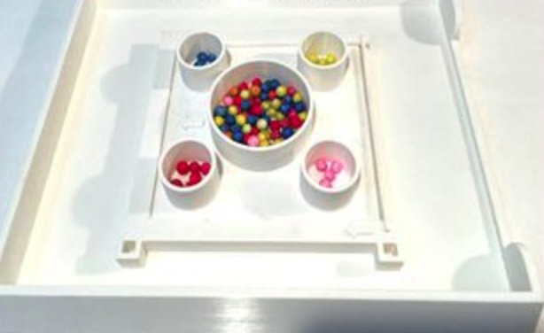
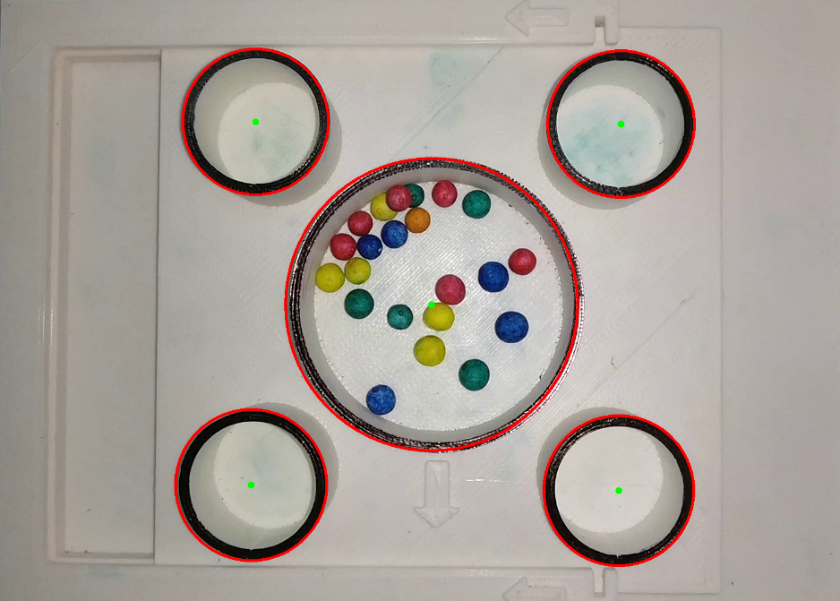
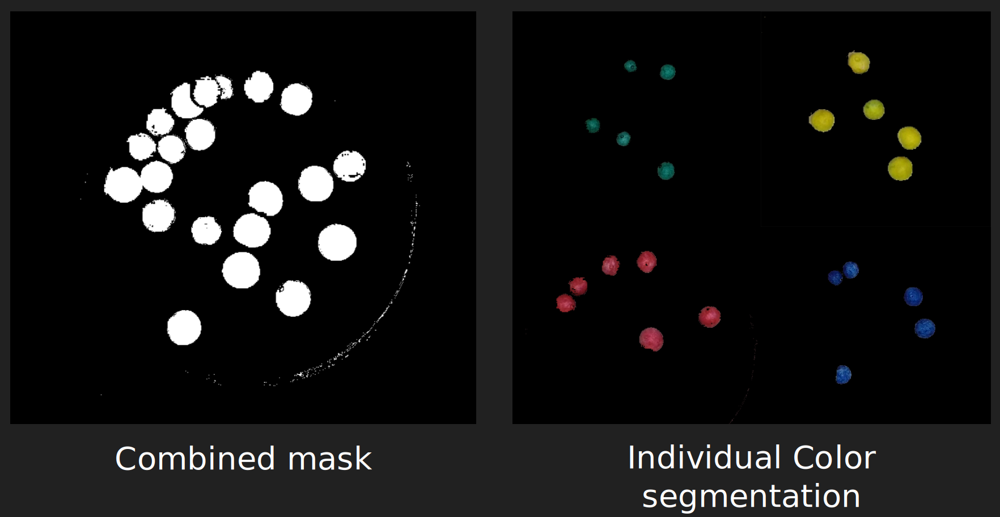
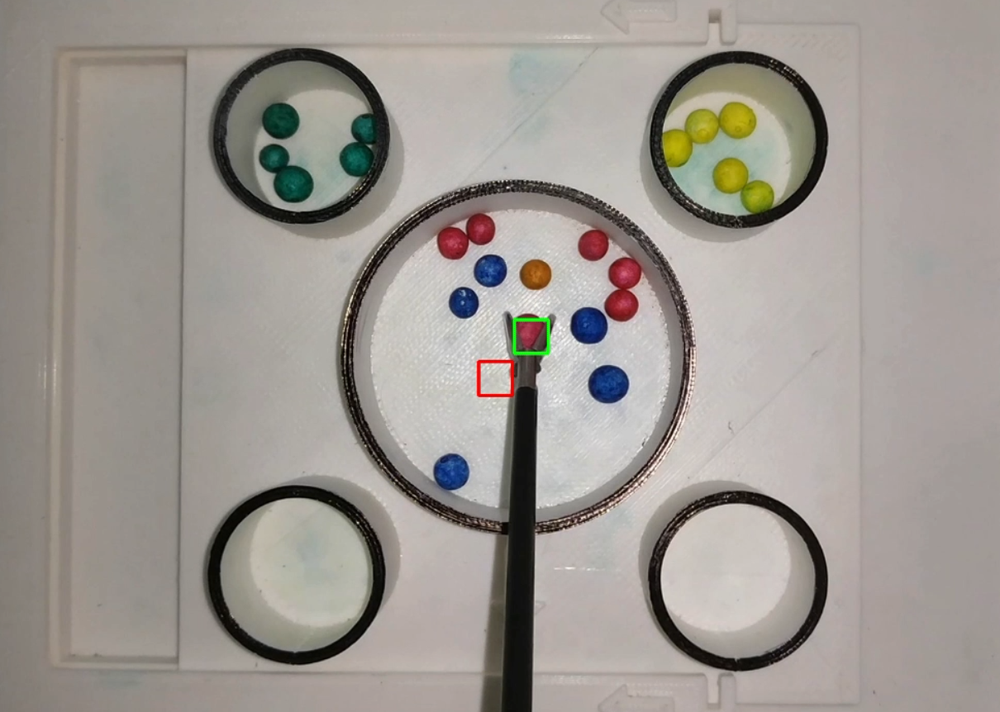
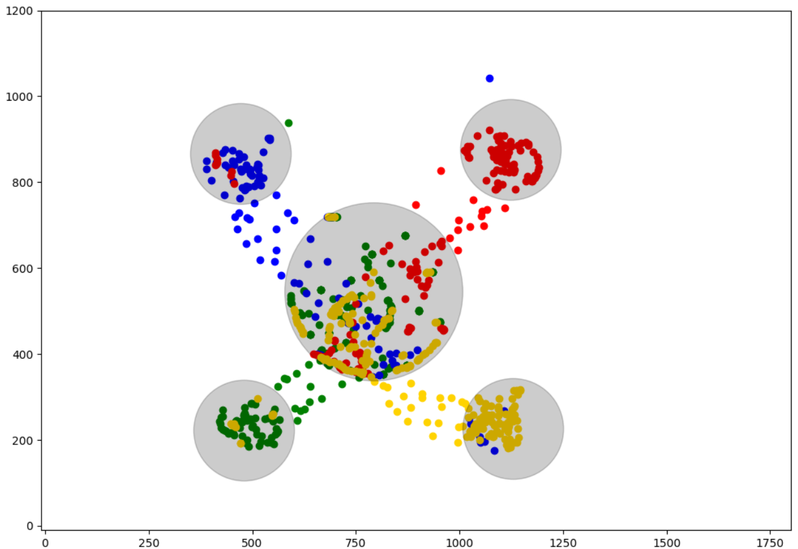

# Vision Based Self-Assessment of Laparoscopic Training Task

Project team members:
1. Srujan Gowdru Lingaraju - gowdr002@umn.edu 
2. Abha Gejji - gejji003@umn.edu

## Project Description:
This vision project is a proof of concept of developing a Self Assessment module for Laproscopic surgical training task.

---
## Surgical Task
The surgical training task is to pick and sort the colored beans inside a Laparoscopic simulator.

   

## Target Localisation

   

1. Gaussian Blur and Canny Edge Detection.
2. Hough Transforms for traget localisation.

## Color Image Segmentation

   

HSV Thresholding for generating object masks

## Object Tracking

   

1. Background subtraction with mask using absolute difference of consecutive frames or by using KNN based subtractor.
2. Bounding box for moving objects
3. Kalman filtering for optimisation

## Trajectories

   

---

## Instructions.
1. There are two videos "sorting_1" and "sorting_2"
2. Run the object_tracking_stable_3.py file with either of the two videos
   1. Replace the path in line 8 of object_tracking_stable_3.py
   2. Replace the path in line 94 of object_tracking_stable_3.py
3. Wait till the video stops and see the performance results in the output terminal
4. Additionally find the generated coordinate_data.txt file for 
information regarding the X_detected;Y_detected;X_predicted;Y_predicted
5. Delete the txt file after each run. (This is to avoid false position information)
